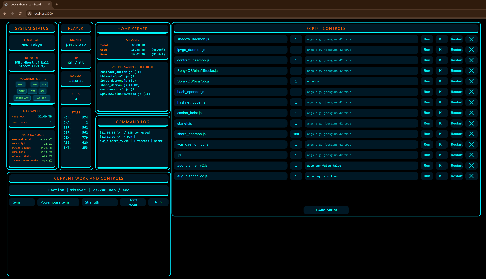
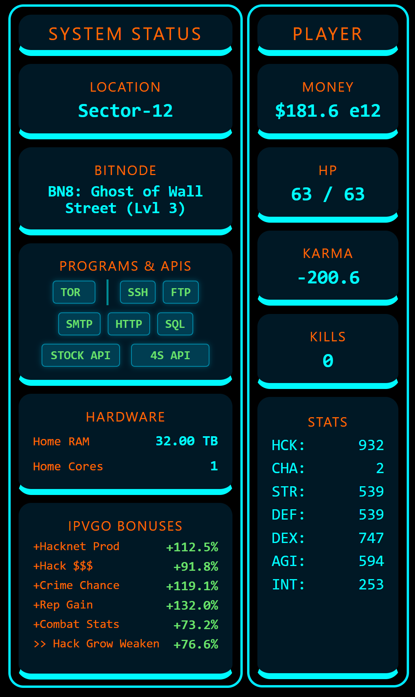
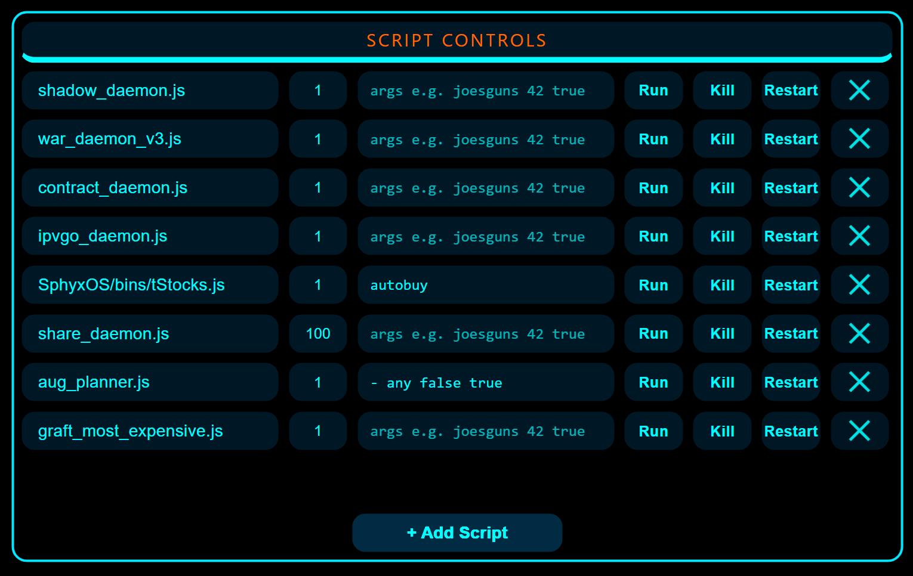
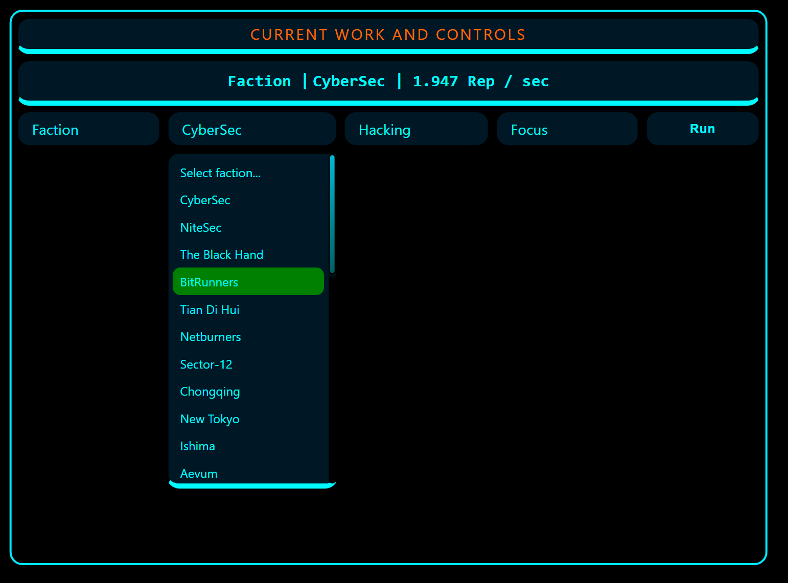

# Bitburner External Dashboard

A customizable, real-time external dashboard for [Bitburner](https://github.com/bitburner-official/bitburner-src) that displays game data and executes commands through an elegant web interface. Built with extensibility in mind - add your own widgets, customize the appearance, and automate your gameplay.



## Features

### Current Widgets

| Widget | Description |
|--------|-------------|
| **Player** | Money, HP, Karma, Kills, and all seven stats (Hack, Str, Def, Dex, Agi, Cha, Int) |
| **System Status** | Current city, BitNode info, owned programs (TOR + port openers), API access (Stock/4S), home hardware specs, and IPvGO faction bonuses |
| **Home Server** | RAM usage breakdown (total/used/free with percentages) and filtered active scripts list |
| **Work Controls** | Switch between Company, Faction, Crime, Gym, and University work with full configuration (location, activity type, focus toggle) |
| **Script Controls** | Run, kill, or restart scripts on home server with configurable threads and arguments. Persistent script list with add/remove functionality |
| **Command Log** | Timestamped log of all commands sent with status indicators (OK/PENDING/FAILED) |

### Screenshots

<table>
<tr>
<td width="33%">

**Player & System Status**



</td>
<td width="33%">

**Script Controls**



</td>
<td width="33%">

**Work Controls**



</td>
</tr>
</table>

## Quick Start

### Prerequisites

- [Node.js](https://nodejs.org/) v16+ 
- [Bitburner](https://store.steampowered.com/app/1812820/Bitburner/) (Steam or browser)
- Basic JavaScript knowledge for customization

### Installation

1. **Clone the repository**
   ```bash
   git clone https://github.com/kaoticengineering/kaotic-bitburner-dashboard.git
   cd kaotic-bitburner-dashboard
   ```

2. **Install dependencies**
   ```bash
   npm install express
   ```

3. **Start the server**
   ```bash
   node server.js
   ```
   
   Server starts on `http://localhost:3000` by default.

4. **Open the dashboard**
   
   Navigate to `http://localhost:3000` in your browser.

5. **Connect Bitburner**
   
   Create a telemetry script in Bitburner that:
   - Collects game data every 500ms (or your preferred interval)
   - POSTs data to `http://localhost:3000/bitburner-data`
   - Polls `http://localhost:3000/commands/next` for commands to execute
   
   See [Bitburner Integration](#bitburner-integration) section for implementation details.

## Architecture

```
┌─────────────────┐         ┌─────────────────┐         ┌─────────────────┐
│                 │  POST   │                 │   SSE   │                 │
│   Bitburner     │────────►│  Node Server    │────────►│   Dashboard     │
│ [bbRemoteOps.js]│         │  (Express)      │         │   (Browser)     │
│     (Game)      │◄────────│                 │◄────────│                 │
│                 │   GET   │                 │  POST   │                 │
└─────────────────┘         └─────────────────┘         └─────────────────┘

```

### Data Flow

**Telemetry (Game → Dashboard):**
1. Your Bitburner script collects game state via NS functions
2. Script POSTs JSON payload to `/bitburner-data`
3. Express server stores the latest state and broadcasts via SSE
4. Dashboard widgets receive updates through `/stream` endpoint
5. Each widget renders its portion of the data

**Commands (Dashboard → Game):**
1. User interacts with dashboard (clicks "Run", changes work, etc.)
2. Dashboard POSTs command to `/command` endpoint
3. Server queues the command with metadata (ID, timestamp, type)
4. Bitburner script polls `/commands/next` endpoint
5. Script receives command and executes corresponding NS functions
6. Result feeds back through telemetry

## Project Structure

```
bitburner-controls-node/
├── server.js                 # Express server (API, SSE, static hosting)
├── package.json              # Dependencies
│
├── public/                   # Static dashboard files
│   ├── dashboard.html        # Main HTML structure
│   │
│   ├── css/
│   │   └── dashboard.css     # Styling (heavily customizable via CSS variables)
│   │
│   └── js/
│       ├── lib/
│       │   ├── data.js       # Static data (factions, companies, crimes, etc.)
│       │   ├── fmt.js        # Formatting utilities (money, RAM, rates)
│       │   ├── util.js       # DOM helpers and custom select enhancement
│       │   └── interact.min.js  # Drag/resize library (local copy)
│       │
│       ├── widgets/
│       │   ├── player.js     # Player stats widget
│       │   ├── system.js     # System status widget
│       │   ├── home.js       # Home server widget
│       │   ├── work.js       # Work controls widget
│       │   ├── scripts.js    # Script controls widget
│       │   ├── log.js        # Command log widget
│       │   └── floating.js   # Drag/resize/persistence logic
│       │
│       └── dashboard.js      # Main orchestrator (SSE, init, commands)
│
└── bitburner/
    └── (your telemetry script goes here)
```

## Bitburner Integration

Your Bitburner script needs to implement two parallel loops: one for telemetry (game → dashboard) and one for commands (dashboard → game).

### Implementation Pattern

The script runs continuously with smart timing to avoid unnecessary overhead:

```javascript
/** @param {NS} ns */
export async function main(ns) {
  const SERVER_URL = "http://localhost:3000";
  const SEND_DATA_MS = 500;      // Telemetry interval
  const TRY_GET_CMD_MS = 500;    // Command polling interval
  
  let nextTelemetryTime = 0;
  let nextCommandTime = 0;
  let consecutiveFailures = 0;
  
  while (true) {
    const now = Date.now();
    
    // ---- Telemetry ----
    if (now >= nextTelemetryTime) {
      try {
        const payload = buildTelemetryPayload(ns, now);
        await fetch(`${SERVER_URL}/bitburner-data`, {
          method: "POST",
          headers: { "Content-Type": "application/json" },
          body: JSON.stringify(payload),
        });
        consecutiveFailures = 0;
      } catch (error) {
        consecutiveFailures++;
      } finally {
        nextTelemetryTime = now + SEND_DATA_MS;
      }
    }
    
    // ---- Commands ----
    if (now >= nextCommandTime) {
      try {
        const response = await fetch(`${SERVER_URL}/commands/next`);
        
        if (response.status === 204) {
          // No commands available
        } else if (response.ok) {
          const cmd = await response.json();
          if (cmd?.type) await handleCommand(ns, cmd);
        }
        
        consecutiveFailures = 0;
      } catch (error) {
        consecutiveFailures++;
      } finally {
        nextCommandTime = now + TRY_GET_CMD_MS;
      }
    }
    
    // Smart sleep with backoff on failures
    const nextWakeTime = Math.min(nextTelemetryTime, nextCommandTime);
    let sleepDuration = Math.max(1, nextWakeTime - Date.now());
    
    if (consecutiveFailures > 0) {
      const backoffMs = Math.min(5000, 250 * consecutiveFailures);
      sleepDuration = Math.max(sleepDuration, backoffMs);
    }
    
    await ns.sleep(Math.min(sleepDuration, 200));
  }
}
```

### Telemetry Payload Builder

Collect and structure game state for the dashboard:

```javascript
function buildTelemetryPayload(ns, timestamp) {
  const player = ns.getPlayer();
  const home = ns.getServer("home");
  const resetInfo = ns.getResetInfo();
  
  // Calculate BitNode level (current run + previous completions)
  const bitnodeNumber = resetInfo.currentNode;
  const previousCompletions = resetInfo.ownedSF.get(bitnodeNumber) ?? 0;
  const bitnodeLevel = previousCompletions + 1;
  
  // Get current work
  let currentWork = null;
  try {
    currentWork = ns.singularity?.getCurrentWork?.() ?? null;
  } catch {}
  
  // Filter scripts (optional: exclude attack scripts from display)
  const allProcs = ns.ps("home");
  const displayProcs = allProcs
    .filter(p => !p.filename.startsWith("attack_"))
    .map(p => ({
      filename: p.filename,
      threads: p.threads,
      args: p.args,
      pid: p.pid,
    }));
  
  return {
    time: timestamp,
    
    player: {
      money: player.money,
      hpCurrent: player.hp.current,
      hpMax: player.hp.max,
      karma: player.karma,
      kills: player.numPeopleKilled,
      city: player.city,
      
      bitnode: {
        number: bitnodeNumber,
        name: BITNODE_NAMES[bitnodeNumber] ?? "Unknown",
        level: bitnodeLevel,
      },
      
      stats: {
        hack: player.skills.hacking,
        str: player.skills.strength,
        def: player.skills.defense,
        dex: player.skills.dexterity,
        agi: player.skills.agility,
        cha: player.skills.charisma,
        int: player.skills.intelligence,
      },
      
      work: buildWorkInfo(currentWork),  // See below
    },
    
    home: {
      maxRam: home.maxRam,
      usedRam: home.ramUsed,
      cpuCores: home.cpuCores,
      procs: displayProcs,
    },
    
    programs: {
      hasTor: checkTorOwnership(ns),
      portOpeners: {
        owned: ["BruteSSH.exe", "FTPCrack.exe", "relaySMTP.exe", 
                "HTTPWorm.exe", "SQLInject.exe"]
          .filter(exe => ns.fileExists(exe, "home")),
      },
    },
    
    stockApi: {
      hasTixApi: ns.stock?.hasTIXAPIAccess?.() ?? false,
      has4sData: ns.stock?.has4SDataTIXAPI?.() ?? false,
    },
    
    ipvgo: getIpvgoBonuses(ns),
  };
}

function buildWorkInfo(work) {
  if (!work) return null;
  
  return {
    type: work.type,
    companyName: work.companyName,
    factionName: work.factionName,
    factionWorkType: work.factionWorkType,
    crimeType: work.crimeType,
    classType: work.classType,
    location: work.location,
    cyclesWorked: work.cyclesWorked,
    
    // Optional: calculate rep/exp rates (advanced)
    repPerSec: calculateRepRate(work),      // Your implementation
    expPerSec: calculateExpRate(work),      // Your implementation
  };
}

function getIpvgoBonuses(ns) {
  try {
    const stats = ns.go?.analysis?.getStats?.();
    if (!stats) return null;
    
    const bonuses = {};
    for (const [faction, data] of Object.entries(stats)) {
      bonuses[faction] = {
        bonusPercent: data.bonusPercent,
        bonusDescription: data.bonusDescription,
      };
    }
    return bonuses;
  } catch {
    return null;
  }
}

function checkTorOwnership(ns) {
  try {
    // If getDarkwebProgramCost returns -1, TOR not owned
    const cost = ns.singularity?.getDarkwebProgramCost?.("BruteSSH.exe");
    return cost !== undefined && cost !== -1;
  } catch {
    return false;
  }
}
```

### Command Handler

Execute commands received from the dashboard:

```javascript
async function handleCommand(ns, cmd) {
  switch (cmd.type) {
    case "scriptAction":
      await handleScriptAction(ns, cmd);
      break;
    case "workAction":
      await handleWorkAction(ns, cmd);
      break;
    default:
      ns.tprint(`Unknown command: ${cmd.type}`);
  }
}

async function handleScriptAction(ns, cmd) {
  // Commands can have payload at root or nested
  const src = cmd.payload ?? cmd;
  
  const action = String(src.action ?? "").toLowerCase();
  const host = src.host ?? "home";
  const script = src.script;
  const threads = Math.max(1, Math.floor(Number(src.threads ?? 1)));
  const args = (src.args ?? []).map(coerceArg);  // Convert string args
  
  if (!script) {
    ns.tprint(`scriptAction missing script`);
    return;
  }
  
  switch (action) {
    case "run":
      const pid = host === "home"
        ? ns.run(script, threads, ...args)
        : ns.exec(script, host, threads, ...args);
      ns.tprint(pid > 0 ? `Started ${script} (pid ${pid})` : `Failed to start ${script}`);
      break;
      
    case "kill":
      ns.scriptKill(script, host);
      ns.tprint(`Killed ${script}`);
      break;
      
    case "restart":
      if (ns.scriptRunning(script, host)) {
        ns.scriptKill(script, host);
        await ns.sleep(50);
      }
      const restartPid = host === "home"
        ? ns.run(script, threads, ...args)
        : ns.exec(script, host, threads, ...args);
      ns.tprint(restartPid > 0 ? `Restarted ${script}` : `Failed to restart ${script}`);
      break;
  }
}

async function handleWorkAction(ns, cmd) {
  const src = cmd.payload ?? cmd;
  const action = String(src.action ?? "start").toLowerCase();
  
  if (action === "stop") {
    ns.singularity.stopAction();
    return;
  }
  
  const workType = String(src.workType ?? "").toUpperCase();
  const focus = Boolean(src.focus ?? false);
  
  // Stop current work before starting new work
  ns.singularity.stopAction();
  await ns.sleep(50);
  
  let ok = false;
  switch (workType) {
    case "COMPANY":
      ok = ns.singularity.workForCompany(src.companyName, focus);
      break;
    case "FACTION":
      ok = ns.singularity.workForFaction(
        src.factionName,
        src.factionWorkType ?? "Hacking",
        focus
      );
      break;
    case "CRIME":
      ok = ns.singularity.commitCrime(src.crime ?? "Shoplift", focus) > 0;
      break;
    case "GYM":
      ok = ns.singularity.gymWorkout(
        src.gymName,
        src.stat ?? "Strength",
        focus
      );
      break;
    case "UNIV":
      ok = ns.singularity.universityCourse(
        src.universityName,
        src.course,
        focus
      );
      break;
  }
  
  ns.tprint(`Work ${workType}: ${ok ? "success" : "failed"}`);
}

function coerceArg(arg) {
  // Convert string arguments to proper types
  if (typeof arg !== "string") return arg;
  const trimmed = arg.trim();
  
  if (trimmed === "true") return true;
  if (trimmed === "false") return false;
  if (trimmed === "null") return null;
  if (trimmed === "") return "";
  
  const num = Number(trimmed);
  if (!Number.isNaN(num) && Number.isFinite(num)) return num;
  
  return arg;
}
```

### Complete Example

A production-ready implementation with rate tracking, error handling, and smart backoff is available in the repository at `bitburner/remoteOps.js`. Key features include:

- **EMA-based rate calculation** - Smooth rep/sec and exp/sec calculations
- **Work change detection** - Resets rate tracking when activity changes
- **Attack script filtering** - Keeps home server display clean
- **Exponential backoff** - Reduces load when server is unreachable
- **Command logging** - Terminal output for debugging

The example script is heavily commented and ready to use or adapt to your needs.

## Customization Guide

### Adding a New Widget

Widgets follow a simple, consistent pattern:

1. **Create widget JavaScript** (`public/js/widgets/mywidget.js`):

```javascript
(() => {
  function render(data) {
    // Update DOM based on telemetry data
    const el = document.getElementById("my-widget-value");
    if (el) el.textContent = data?.myValue ?? "--";
  }
  
  function init() {
    // Set up event listeners, load saved state, etc.
    document.getElementById("my-button")?.addEventListener("click", () => {
      window.sendCommand("myCommand", { foo: "bar" });
    });
  }
  
  window.MyWidget = { render, init };
})();
```

2. **Add HTML section** (`public/dashboard.html`):

```html
<section class="panel widget" data-widget="mywidget">
  <div class="widget-bar">
    <div class="section-title">My Widget</div>
  </div>
  
  <div class="widget-body">
    <div class="block">
      <div class="label">My Value</div>
      <div class="value mono" id="my-widget-value">--</div>
    </div>
    <button class="btn" id="my-button">Do Thing</button>
  </div>
  
  <div class="resize-hint" aria-hidden="true"></div>
</section>
```

3. **Include script** (add to `dashboard.html` in the scripts section):

```html
<script src="/js/widgets/mywidget.js"></script>
```

4. **Register widget** (`public/js/dashboard.js` in `render()` and `initDashboard()`):

```javascript
function render(d) {
  // ...
  window.MyWidget?.render(d.myData);
}

function initDashboard() {
  // ...
  window.MyWidget?.init();
}
```

5. **Add default position** (`public/js/widgets/floating.js` in `defaultRects()`):

```javascript
mywidget: { x: 640, y: 20, w: 320, h: 240, z: 1 },
```

That's it! Your widget will automatically be draggable, resizable, and persistent.

### Theming

All colors and styling are controlled via CSS variables in `dashboard.css`:

```css
:root {
  /* Typography */
  --font-size: 16px;
  --font-sans: system-ui, -apple-system, ...;
  --font-mono: ui-monospace, SFMono-Regular, ...;
  
  /* Colors - Background */
  --bg-gradient-clr1: #000000;
  --bg-gradient-clr2: #000000;
  --bg-widget-panel: #000000;
  --bg-widget-surface: #001825;
  
  /* Colors - Text */
  --txt-clr-general: #00fcff;     /* Cyan */
  --txt-clr-titles: #ff6900;      /* Orange */
  --txt-clr-owned-exe: rgb(107, 223, 107);   /* Green */
  --txt-clr-not-owned-exe: rgb(223, 107, 107);  /* Red */
  
  /* Status Colors */
  --clr-status-good: #A9D35E;
  --clr-status-warn: #FFD27A;
  --clr-status-bad: #FF6457;
  
  /* Borders */
  --border-general: 3px solid #000000;
  --border-bottom-accent: 7px solid #00faff;
  
  /* Layout */
  --radius: 17px;
  --gap: 0.4rem;
  
  /* Interaction */
  --hover-brightness: 1.8;
}
```

**Want a different theme?** Just change the variables. Example red theme:

```css
:root {
  --txt-clr-general: #ff4444;
  --txt-clr-titles: #ffaa00;
  --border-bottom-accent: 7px solid #ff4444;
}
```

See [CSS-IMPROVEMENTS-GUIDE.md](docs/CSS-IMPROVEMENTS-GUIDE.md) for detailed customization options.

### Adding Static Data

Need to add factions, companies, or other static data? Edit `public/js/lib/data.js`:

```javascript
const FACTION_NAMES = [
  "CyberSec",
  "NiteSec",
  // ... add more
];
```

This file is the single source of truth for all lookups used across widgets.

## Configuration

### Server Configuration

Edit `server.js` to customize server behavior:

```javascript
const PORT = 3000;  // Change port

// Restrict to localhost only (disable LAN access)
app.listen(PORT, "localhost", () => { ... });

// Or allow LAN access (default)
app.listen(PORT, () => { ... });
```

**Enable authentication:**

```javascript
// In server.js
state.config.requireToken = true;

// Set token via environment variable
// In terminal: export BB_TOKEN="your-secure-token"
// In Bitburner script: headers: { "X-BB-Token": "your-secure-token" }
```

### Dashboard Configuration

**Reset widget layout:**
- Press `Ctrl + Shift + R` to reset all widget positions/sizes to defaults

**Clear script list:**
- Stored in `localStorage` as `bb_script_controls_v2`
- Clear via browser DevTools → Application → Local Storage

**Adjust update interval:**
- Modify `await ns.sleep(500)` in your Bitburner telemetry loop
- Lower = more real-time, higher = less overhead

## API Reference

### Endpoints

| Method | Endpoint | Description | Request Body | Response |
|--------|----------|-------------|--------------|----------|
| `GET` | `/` | Serves dashboard HTML | - | HTML page |
| `GET` | `/stream` | SSE stream for real-time updates | - | `text/event-stream` |
| `GET` | `/current` | Current game state snapshot | - | JSON (telemetry data) |
| `POST` | `/bitburner-data` | Receive telemetry from Bitburner | JSON (game state) | `200 OK` |
| `POST` | `/command` | Queue command for Bitburner | JSON `{type, payload}` | JSON `{ok, id, queued}` |
| `GET` | `/commands/next` | Poll next queued command | - | JSON (command) or `204` |
| `GET` | `/commands` | View command queue (debug) | - | JSON `{queued, commands}` |
| `GET` | `/config` | Get server config | - | JSON (config) |
| `POST` | `/config` | Update server config | JSON (partial config) | JSON (new config) |

### Command Types

#### Script Action

```json
{
  "type": "scriptAction",
  "payload": {
    "action": "run" | "kill" | "restart",
    "host": "home",
    "script": "myscript.js",
    "threads": 1,
    "args": ["arg1", "arg2"]
  }
}
```

#### Work Action

```json
{
  "type": "workAction",
  "payload": {
    "action": "start",
    "workType": "COMPANY" | "FACTION" | "CRIME" | "GYM" | "UNIV",
    "companyName": "ECorp",           // for COMPANY
    "factionName": "CyberSec",        // for FACTION
    "factionWorkType": "Hacking",     // for FACTION
    "crime": "Homicide",              // for CRIME
    "gymName": "Powerhouse Gym",      // for GYM
    "stat": "Strength",               // for GYM
    "universityName": "Rothman University",  // for UNIV
    "course": "Algorithms",           // for UNIV
    "focus": true
  }
}
```

## Known Limitations

- **Work Widget** is currently limited in scope:
  - Does not support Grafting
  - Does not support Bladeburner activities
  - Does not support Sleeve management
  - These features may be added in future updates

## Roadmap

- [ ] Enhanced CSS customization system with theme import/export
- [ ] Enhance Custom Dropdowns to escape widget boundaries
- [ ] Convert Page Status to a proper widget
- [ ] Tabbed workspaces for organizing widgets
- [ ] Widget minimize/maximize/close functionality
- [ ] **New Widgets:**
  - [ ] Grafting widget
  - [ ] Stocks widget
  - [ ] Bladeburner widget
  - [ ] Sleeves widget
- [ ] IPvGO widget improvements (display bonus descriptions in a more detailed view)
- [ ] Expanded Work Controls (Grafting, Bladeburner, additional options)
- [ ] Dashboard-side logic/automation to complement Bitburner scripts

## Troubleshooting

**Dashboard shows "No data yet"**
- Ensure your Bitburner telemetry script is running
- Check the script is POSTing to the correct URL (`http://localhost:3000/bitburner-data`)
- Verify Node server is running (check terminal output)
- Check browser console for errors (F12 → Console)

**Commands not executing in game**
- Verify your script is polling `/commands/next` endpoint
- Check command handler logic in your Bitburner script
- Look for errors in your Bitburner terminal
- Enable `state.config.verboseLogs = true` in server.js for debugging

**Widgets not saving position**
- Check if localStorage is enabled in your browser
- Try `Ctrl + Shift + R` to reset and re-save positions
- Check browser console for localStorage errors

**SSE connection failing**
- Some browsers limit SSE connections - try a different browser
- Check browser console for connection errors
- Verify server isn't blocked by firewall

## Contributing

Contributions are welcome! This project is designed to be extended.

**Ideas for contributions:**
- New widgets (Stocks, Bladeburner, Sleeves, Gang, Corporation)
- Theme presets
- Improved mobile responsiveness
- Additional utility functions
- Better error handling
- Documentation improvements

Feel free to open issues for bugs or feature requests, and PRs for improvements!

## License

[MIT](LICENSE)

## Acknowledgments

- **[Bitburner](https://github.com/bitburner-official/bitburner-src)** - The incredible incremental hacking game that inspired this
- **[Interact.js](https://interactjs.io/)** - Drag and resize functionality
- **Bitburner Discord Community** - For inspiration and support

---

**Built with ☕ and 🧡 by [kaoticengineering](https://github.com/kaoticengineering)**